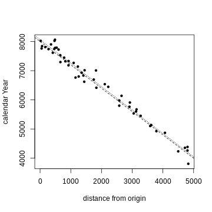
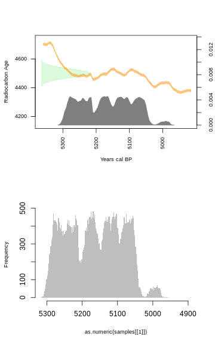
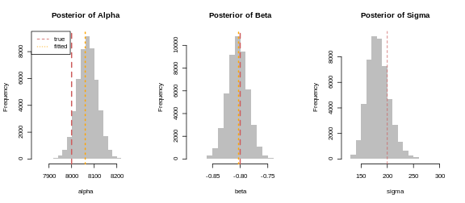
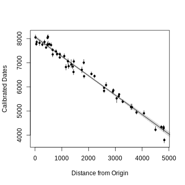

# Generate Artificial Data

We first simulate a linear model in calendar time. 

Given the following parameter values

```r
N=50 #number of samples
d=runif(N,min=0,max=5000) #distance from origin
alpha=8000 #intercept (date of earliest farming at the origin)
beta=-0.8 #beta coefficient (i.e. rate of expansion)
sigma=200 #standard deviation (uncertainty in the arrival date at given distance)
```

We generate possible dates of arrival:

```r
arrivalDates=rnorm(N,mean=alpha+beta*d,sd=sigma)
plot(d,arrivalDates,xlab="distance from origin",ylab="calendar Year",pch=20)
abline(a=alpha,b=beta,lty=2) #theorethical model
abline(lm(arrivalDates~d),lty=3)
```



```r
fitted.alpha=coefficients(lm(arrivalDates~d))[1]
fitted.beta=coefficients(lm(arrivalDates~d))[2]
```


We then transform the the calendar dates in $^14$C dates, and associate each with a random error:


```r
library(rcarbon) #we use the rcarbon package
arrivalDates.14c = round(uncalibrate(arrivalDates,calCurves = "intcal13")$ccCRA)
arrivalDates.Error = sample(c(20,30,40,50),size=N,replace=TRUE)
```


We now fit the model using *rJAGS*. This is done automatically by the function `jagsSpeed()`, which contains a wrapper function. The specific JAGS model implemented is an updated version of the MCMC calibration, which looks like this (and is implemented in `jagsCalibrate()`):

```
model{
		for (i in 1:nDate) {
			theta[i] ~ dunif(0,49980)
			mu[i] <- interp.lin(theta[i], calBP[], C14BP[])
			sigmaCurve[i] <- interp.lin(theta[i], calBP[], C14err[])
			tau[i] <- 1/(pow(sigma[i],2)+pow(sigmaCurve[i],2))
			X[i] ~ dnorm(mu[i],tau[i])
			one.year[i] <- round(theta[i])
		}
	}
```

Here `X` is the observed $^14$C age, `sigma` is the associated error and `nDate` is the sample size. The variable `theta` is the calendar year. Notice that the assumption here is that the prior for `theta` is the a uniform distribution of all calendar ages.

We can check if this works:


```r
par(mfrow=c(2,1))
plot(calibrate(4500,30)) #using rcarboin
samples=jagsCalibrate(4500,30,raw=TRUE,plot=FALSE)
hist(as.numeric(samples[[1]]),xlim=rev(range(samples[[1]])),border=NA,col="grey",breaks=200,main="")
```



Of course the result would change every time as these are samples from the posterior distribution.

We can modify the JAGS model by assuming that actually `theta` comes from a linear model with `alpha` (our interecept), `beta` (our rate), etc...

```
model{
		for (i in 1:nDate) {
			theta[i] ~ dnorm(mean[i],gamma)	 #likelihood function
      mean[i] <- alpha + beta * d[i]	 #linear model		
			mu[i] <- interp.lin(theta[i], calBP[], C14BP[])
			sigmaCurve[i] <- interp.lin(theta[i], calBP[], C14err[])
			tau[i] <- 1/(pow(sigma[i],2)+pow(sigmaCurve[i],2))
			X[i] ~ dnorm(mu[i],tau[i])
			one.year[i] <- round(theta[i]) #round to the year
		}
		# priors:
    alpha ~ dunif(0,50000)
		beta ~ dnorm(0,10)
		gamma <- pow(pregamma, -2)
    pregamma ~ dunif(0,500)
	}
```

Notice that in this particular case the prior for sigma is between 0 and 500 years.

Now let's use`jagsSpeed()`:


```r
post.samples=jagsSpeed(x=arrivalDates.14c,error=arrivalDates.Error,distance=d)
post.samples=as.data.frame(post.samples[[1]])
```

The resulting object contains the posterior distribution we need. Let's start by plotting them against their "true" values:


```r
par(mfrow=c(1,3))
hist(post.samples$alpha,border=NA,col="grey",main="Posterior of Alpha",xlab="alpha")
abline(v=alpha,lty=2,col="indianred",lwd=2)
abline(v=fitted.alpha,lty=3,col="orange",lwd=2)
legend("topleft",legend=c("true","fitted"),lty=c(2,3),col=c("indianred","orange"))

hist(post.samples$beta,border=NA,col="grey",main="Posterior of Beta",xlab="beta")
abline(v=beta,lty=2,col="indianred",lwd=2)
abline(v=fitted.beta,lty=3,col="orange",lwd=2)

hist(sqrt(post.samples$gamma^-1),border=NA,col="grey",main="Posterior of Sigma",xlab="sigma")
abline(v=sigma,lty=2,col="indianred")
```



Not too bad...

Let's make a fancy plot out of this:


```r
dates=apply(post.samples,2,quantile,prob=c(0.025,0.975))[,-c(1:3)]
middates=apply(post.samples,2,median)[-c(1:3)]
plot(d,middates,ylim=range(dates),pch=20,xlab="Distance from Origin",ylab="Calibrated Dates")
for (i in 1:N)
{
	lines(rep(d[i],2),dates[,i])
}
dd=seq(0,10000,200)
obsMean=matrix(NA,50000,length(dd))

for (x in 1:length(dd))

{
obsMean[,x]=post.samples$alpha+post.samples$beta*dd[x]
}
mu=apply(obsMean,2,mean)
ci=apply(obsMean,2,PI)
lines(dd,mu)
shade(ci,dd)
```




## Comparison to the current approach

Now let's see what would be the result if we used the median calibrated dates:


```r
arrivalDates.calibrated=calibrate(arrivalDates.14c,arrivalDates.Error) #calibrate
arrivalDates.calibratedMedian = medCal(arrivalDates.calibrated) #compute median dates
```


```r
summary(lm(arrivalDates.calibratedMedian~d))
```

```
## 
## Call:
## lm(formula = arrivalDates.calibratedMedian ~ d)
## 
## Residuals:
##     Min      1Q  Median      3Q     Max 
## -427.28 -110.16    0.66  114.60  456.87 
## 
## Coefficients:
##               Estimate Std. Error t value Pr(>|t|)    
## (Intercept) 8072.39861   43.12111  187.20   <2e-16 ***
## d             -0.80634    0.01808  -44.59   <2e-16 ***
## ---
## Signif. codes:  0 '***' 0.001 '**' 0.01 '*' 0.05 '.' 0.1 ' ' 1
## 
## Residual standard error: 186.8 on 48 degrees of freedom
## Multiple R-squared:  0.9764,	Adjusted R-squared:  0.9759 
## F-statistic:  1989 on 1 and 48 DF,  p-value: < 2.2e-16
```

Actually not so bad either?

